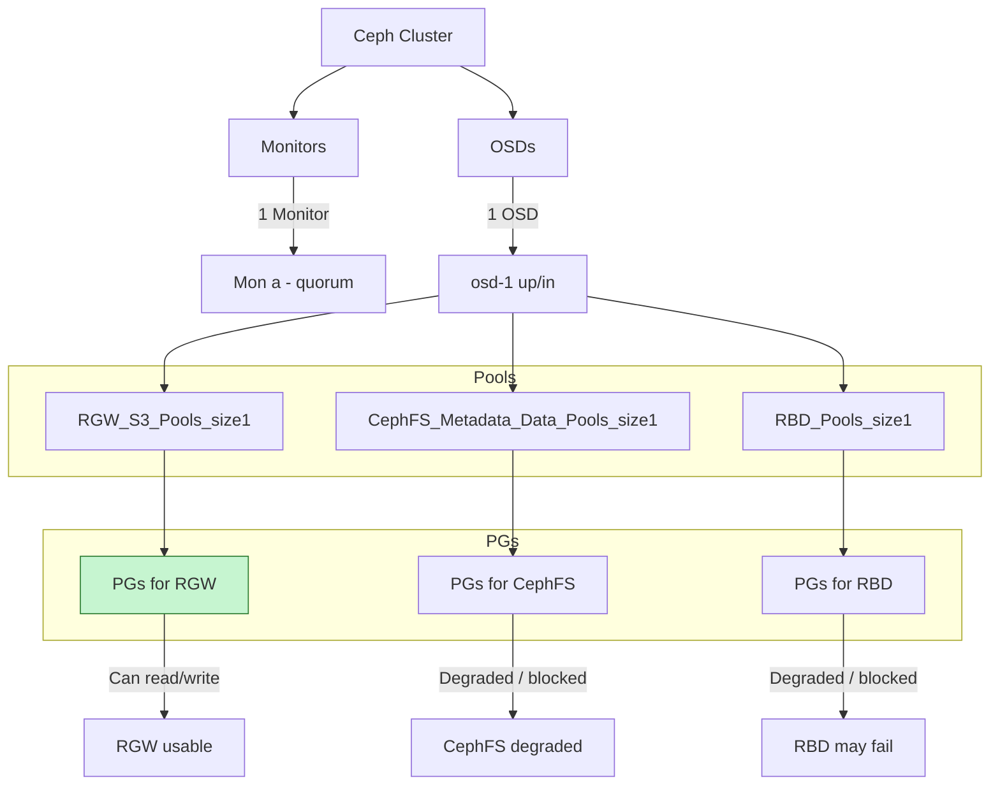

# ceph-command-cheatsheet


```bash
bash-5.1$ ceph osd tree
ID  CLASS  WEIGHT   TYPE NAME                        STATUS  REWEIGHT  PRI-AFF
-1         1.97659  root default                                              
-3         1.97659      host f-titan-aio-001-ct-lan                           
0    hdd  0.48830          osd.0                      down         0  1.00000
1    hdd  0.48830          osd.1                        up   1.00000  1.00000
2    hdd  1.00000          osd.2                        up   1.00000  1.00000
bash-5.1$
```

```bash
bash-5.1$ ceph osd metadata 0
{
    "id": 0,
    "arch": "x86_64",
    "back_addr": "[v2:10.244.156.147:6802/686332882,v1:10.244.156.147:6803/686332882]",
    "back_iface": "",
    "bluefs": "1",
    "bluefs_dedicated_db": "0",
    "bluefs_dedicated_wal": "0",
    "bluefs_single_shared_device": "1",
    "bluestore_allocation_from_file": "0",
    "bluestore_bdev_access_mode": "blk",
    "bluestore_bdev_block_size": "4096",
    "bluestore_bdev_dev_node": "/dev/sdb",
    "bluestore_bdev_devices": "sdb",
    "bluestore_bdev_driver": "KernelDevice",
    "bluestore_bdev_optimal_io_size": "0",
    "bluestore_bdev_partition_path": "/dev/sdb",
    "bluestore_bdev_rotational": "1",
    "bluestore_bdev_size": "536870912000",
    "bluestore_bdev_support_discard": "1",
    "bluestore_bdev_type": "hdd",
    "bluestore_min_alloc_size": "4096",
    "ceph_release": "reef",
    "ceph_version": "ceph version 18.2.4 (e7ad5345525c7aa95470c26863873b581076945d) reef (stable)",
    "ceph_version_short": "18.2.4",
    "ceph_version_when_created": "ceph version 18.2.4 (e7ad5345525c7aa95470c26863873b581076945d) reef (stable)",
    "container_hostname": "rook-ceph-osd-0-fcbf8797b-9htlm",
    "container_image": "172.29.230.136:3000/automationuser/rookceph1.15/ceph/ceph:v18.2.4",
    "cpu": "AMD EPYC 7H12 64-Core Processor",
    "created_at": "2025-06-06T08:27:54.697313Z",
    "default_device_class": "hdd",
    "device_ids": "sdb=Virtual_Disk_60022480a606d9dd478746063ae22b7e",
    "device_paths": "sdb=/dev/disk/by-path/acpi-VMBUS:00-vmbus-7f47eea1cffe43c48589feb52150a8bb-lun-2",
    "devices": "sdb",
    "distro": "centos",
    "distro_description": "CentOS Stream 9",
    "distro_version": "9",
    "front_addr": "[v2:10.244.156.147:6800/686332882,v1:10.244.156.147:6801/686332882]",
    "front_iface": "",
    "hb_back_addr": "[v2:10.244.156.147:6806/686332882,v1:10.244.156.147:6807/686332882]",
    "hb_front_addr": "[v2:10.244.156.147:6804/686332882,v1:10.244.156.147:6805/686332882]",
    "hostname": "f-titan-aio-001.ct.lan",
    "journal_rotational": "1",
    "kernel_description": "#2 SMP Mon Nov 4 23:41:59 PST 2024",
    "kernel_version": "5.15.0-302.167.6.el9uek.x86_64",
    "mem_swap_kb": "4194300",
    "mem_total_kb": "515380840",
    "network_numa_unknown_ifaces": "back_iface,front_iface",
    "objectstore_numa_unknown_devices": "sdb",
    "os": "Linux",
    "osd_data": "/var/lib/ceph/osd/ceph-0",
    "osd_objectstore": "bluestore",
    "osdspec_affinity": "",
    "pod_name": "rook-ceph-osd-0-fcbf8797b-9htlm",
    "pod_namespace": "rook-ceph",
    "rotational": "1"
}
bash-5.1$
```

```bash
bash-5.1$ ceph osd crush rule dump
[
    {
        "rule_id": 0,
        "rule_name": "replicated_rule",
        "type": 1,
        "steps": [
            {
                "op": "take",
                "item": -1,
                "item_name": "default"
            },
            {
                "op": "chooseleaf_firstn",
                "num": 0,
                "type": "host"
            },
            {
                "op": "emit"
            }
        ]
    },
    {
        "rule_id": 1,
        "rule_name": ".rgw.root",
        "type": 1,
        "steps": [
            {
                "op": "take",
                "item": -1,
                "item_name": "default"
            },
            {
                "op": "chooseleaf_firstn",
                "num": 0,
                "type": "host"
            },
            {
                "op": "emit"
            }
        ]
    },
    {
        "rule_id": 2,
        "rule_name": "my-store1.rgw.control",
        "type": 1,
        "steps": [
            {
                "op": "take",
                "item": -1,
                "item_name": "default"
            },
            {
                "op": "chooseleaf_firstn",
                "num": 0,
                "type": "host"
            },
            {
                "op": "emit"
            }
        ]
    },
    {
        "rule_id": 3,
        "rule_name": "my-store1.rgw.meta",
        "type": 1,
        "steps": [
            {
                "op": "take",
                "item": -1,
                "item_name": "default"
            },
            {
                "op": "chooseleaf_firstn",
                "num": 0,
                "type": "host"
            },
            {
                "op": "emit"
            }
        ]
    },
    {
        "rule_id": 4,
        "rule_name": "my-store1.rgw.log",
        "type": 1,
        "steps": [
            {
                "op": "take",
                "item": -1,
                "item_name": "default"
            },
            {
                "op": "chooseleaf_firstn",
                "num": 0,
                "type": "host"
            },
            {
                "op": "emit"
            }
        ]
    },
    {
        "rule_id": 5,
        "rule_name": "my-store1.rgw.otp",
        "type": 1,
        "steps": [
            {
                "op": "take",
                "item": -1,
                "item_name": "default"
            },
            {
                "op": "chooseleaf_firstn",
                "num": 0,
                "type": "host"
            },
            {
                "op": "emit"
            }
        ]
    },
    {
        "rule_id": 6,
        "rule_name": "my-store1.rgw.buckets.non-ec",
        "type": 1,
        "steps": [
            {
                "op": "take",
                "item": -1,
                "item_name": "default"
            },
            {
                "op": "chooseleaf_firstn",
                "num": 0,
                "type": "host"
            },
            {
                "op": "emit"
            }
        ]
    },
    {
        "rule_id": 7,
        "rule_name": "my-store1.rgw.buckets.index",
        "type": 1,
        "steps": [
            {
                "op": "take",
                "item": -1,
                "item_name": "default"
            },
            {
                "op": "chooseleaf_firstn",
                "num": 0,
                "type": "host"
            },
            {
                "op": "emit"
            }
        ]
    },
    {
        "rule_id": 8,
        "rule_name": "my-store1.rgw.buckets.data",
        "type": 1,
        "steps": [
            {
                "op": "take",
                "item": -1,
                "item_name": "default"
            },
            {
                "op": "chooseleaf_firstn",
                "num": 0,
                "type": "host"
            },
            {
                "op": "emit"
            }
        ]
    },
    {
        "rule_id": 9,
        "rule_name": "myfs-metadata",
        "type": 1,
        "steps": [
            {
                "op": "take",
                "item": -1,
                "item_name": "default"
            },
            {
                "op": "chooseleaf_firstn",
                "num": 0,
                "type": "host"
            },
            {
                "op": "emit"
            }
        ]
    },
    {
        "rule_id": 10,
        "rule_name": "myfs-data0",
        "type": 1,
        "steps": [
            {
                "op": "take",
                "item": -1,
                "item_name": "default"
            },
            {
                "op": "chooseleaf_firstn",
                "num": 0,
                "type": "host"
            },
            {
                "op": "emit"
            }
        ]
    },
    {
        "rule_id": 11,
        "rule_name": "replicated-on-osd",
        "type": 1,
        "steps": [
            {
                "op": "take",
                "item": -1,
                "item_name": "default"
            },
            {
                "op": "choose_firstn",
                "num": 0,
                "type": "osd"
            },
            {
                "op": "emit"
            }
        ]
    }
]

bash-5.1$ ceph osd tree
ID  CLASS  WEIGHT   TYPE NAME                        STATUS  REWEIGHT  PRI-AFF
-1         0.48830  root default                                              
-3         0.48830      host f-titan-aio-001-ct-lan                           
1    hdd  0.48830          osd.1                        up   1.00000  1.00000
bash-5.1$ 
```



 


```bash
ceph osd dump | grep ratio
ceph osd set-full-ratio 0.96
ceph osd set-nearfull-ratio 0.90
ceph osd set-backfillfull-ratio 0.93
```


~~~
root@ct-ceph-01:~# ceph osd lspools
1 device_health_metrics
2 images
3 volumes
4 vms
5 backups
6 metrics
7 manila_data
8 manila_metadata
9 .rgw.root
10 default.rgw.log
11 default.rgw.control
12 default.rgw.meta
13 default.rgw.buckets.index
14 default.rgw.buckets.data
16 .nfs
root@ct-ceph-01:~# 
~~~

~~~
root@ct-ceph-01:~# rbd ls images
15c003c4-7921-4263-a994-7a22ce96d720
31442679-83cf-4bdd-843f-2deae8a8195c
414f3cc2-2fe8-49d4-9061-1f6d6b7b2732
4ab5ce92-c702-4cc5-97c0-d2207893481a
879ec559-787f-4abb-b6b7-7af17f44669b
9796560d-52cb-4400-8d54-b30c1da37f79
9bb3e209-586b-4f5c-bcee-e602a39ca728
bfa15a3f-ed2c-4b32-964f-28b608af0c9b
d3a0a021-349e-4706-9331-099c3b43b1b2
root@ct-ceph-01:~# 
~~~

~~~
root@ct-ceph-01:~# rbd info images/31442679-83cf-4bdd-843f-2deae8a8195c
rbd image '31442679-83cf-4bdd-843f-2deae8a8195c':
	size 91 GiB in 23296 objects
	order 22 (4 MiB objects)
	snapshot_count: 1
	id: 33888af7c8a921
	block_name_prefix: rbd_data.33888af7c8a921
	format: 2
	features: layering, exclusive-lock, object-map, fast-diff, deep-flatten
	op_features: 
	flags: 
	create_timestamp: Fri Aug  2 20:24:25 2024
	access_timestamp: Fri Aug  2 20:24:25 2024
	modify_timestamp: Fri Aug  2 20:24:25 2024
root@ct-ceph-01:~# 
~~~


~~~
root@ct-ceph-01:~# rados ls -p  images | grep -i 31442679-83cf-4bdd-843f-2deae8a8195c
rbd_id.31442679-83cf-4bdd-843f-2deae8a8195c
root@ct-ceph-01:~# 
~~~

~~~
root@ct-ceph-01:~# rbd snap ls images/31442679-83cf-4bdd-843f-2deae8a8195c
SNAPID  NAME  SIZE    PROTECTED  TIMESTAMP               
    18  snap  91 GiB  yes        Fri Aug  2 20:24:32 2024
root@ct-ceph-01:~# 
~~~

~~~
root@ct-ceph-01:~# rbd snap protect images/31442679-83cf-4bdd-843f-2deae8a8195c@snap
rbd: snap is already protected
root@ct-ceph-01:~# 
~~~


Basic Command
===

```
ceph -w
ceph health detail
ceph osd df
ceph osd find
ceph-volume lvm list
ceph osd dump
ceph pg repair
ceph osd pool get default.rgw.buckets.data all
```

At physical disk
===

```
smartctl -a /dev/sde 
dmidecode -t system
ssacli ctrl slot=3 ld all show detail | egrep 'Array|Logical|Disk'
```


```
ceph osd blocked-by
ceph osd pool ls detail
ceph osd pool get rbd all
```

```
ceph pg dump | grep pgid
ceph pg pgid
ceph osd primary-affinity 3 1.0
ceph osd map rbd obj
```


Enable/Disable osd
===

```
ceph osd out 0
ceph osd in 0
```

PG repair
===

```
ceph osd map rbd file
ceph pg 0.1a query
ceph pg 0.1a 
ceph pg scrub 0.1a #Checks file exists on OSDs
ceph pg deep-scrub 0.1a #Checks file integrity on OSDs
ceph pg repair 0.1a #Fix problems
```


Delete osd
===

```
ceph osd tree
ceph osd out osd.1
sudo systemctl stop ceph-osd@1.service
ceph osd crush remove osd.1
reph auth del osd.1
ceph osd rm osd.1
```

```
osd primary-affinity
ceph pg pgid mark_unfound_lost revert|delete
ceph osd liost osdid --yes-i-really-mean-it
```

Ceph control
===

```
ceph daemon osd.1 config get osd_scrub_min-interval

ceph --admin-daemon socket-file-path command
/var/run/ceph/$cluster-$type.$id.asok
perf dump
config show
dump_historic_ops
scrub_path
```

Version check
===

```
ceph tell mon.* version
ceph tell osd.* version
```


updates
===

```
Update one mon at the time
/usr/share/ceph-ansible/infrastructure-playbooks/rolling_updates.yaml
```


Ceph cluster flags
===

```
ceph osd set

noup    #Do not auto mark osd as up state
nopdown #Do not auto mark OSD as down state
noout   # Do not remove any osds from crush map. Used when performinig maintenance os parts of the cluster. Prevents crush from auto reblancing the cluster when OSDs are stopped.
noin    # Mons will mark running OSDs with the in state. prevents data from beeing auto allocated to that specific OSD
norecover # Prevents any recovery operations. Used when performing maintenance or a cluster shutdown
nobackfill # Prevents any backfill operation. Used when performing maintenance of a cluster. 
noscrub # No scrubbing operations. Scrubbing has performance impact on a PG on the OSD. If a OSD is too slow it will be marked as down.
nodeep-scrub 
norebalance # Prevents rebalancing from runniung
```


Crush map
===

```
ceph osd getcrushmap -o map.bin
crushtool -d map.bin -o map.txt
crushtool -i map.bin --test --show-mapping --rule=5 --num-rep 3
crushtool -c map.txt -o map.bin
ceph osd setcrushmap -i map.bin
```

```
ceph osd crush class ls
ceph osd crush tree
ceph osd crush rule ls
```

```
ceph osd pool create fast_ssd 32 32 onssd
ceph pg dump pgs_brief
ceph pg dump pgs_brief | grep ^46 #Pool ID
ceph osd lspools
ceph df
```


Buckets
===

```
ceph osd crush add-bucket default-pool root
ceph osd crush add-bucket rack1 rack
ceph osd crush add-bucket rack2 rack
ceph osd crush add-bucket hosta host
ceph osd crush add-bucket hostb host
ceph osd crush move rack1 root=default-pool
ceph osd crush move rack2 root=default-pool
ceph osd crush move hosta rack=rack1
ceph osd crush move hostb rack=rack2

ceph osd crush tree
```


OSD tools
===

```
ceph osd set-full-ratio 0.97
ceph osd set-nearfull-ratio 0.9
ceph osd dump

ceph osd getmap -o ./map.bin
osdmaptool --print ./map.bin
osdmaptool --export-crush ./crush.bin ./map.bin
crushtool -d ./crush.bin -o ./crush.txt 
crushtool -c ./crush.txt -o crushnew.bin
osdmaptool --import-crush ./crushnew.bin ./map.bin
osdmaptool --test-map-pgs-dump ./map.bin
```

OSD files
===

```
/var/lib/ceph/osd/ceph-1/current/0.1a_head/
```


Moving an OSD journal to an SSD
===

```
ceph osd set noout
systemctl stop ceph-osd@3.service
ceph-osd -i 3 --flush-journal
rm -rf /var/lib/ceph/osd/ceph-3/journal
ln -s /dev/sdc1 /var/lib/ceph/osd/ceph-3/journal
ceph-osd -i 3 --mkjournal
systemctl start ceph-osd@3.service
ceph osd unset noout
```

Placement gorup calc
===

```
Total palcement grous = (OSDs * 100) / Number of replicas
Start between 100 to 200 - Never go above 300+
```

```
ceph osd pool get rbd pg_num #Total number of pgs in the pool 
ceph osd pool get rbd pgp_num #Total number of of pgs used for hasing in the pool
```


Rados
===

```
rados -p rbd put file /etc/ceph/ceph.conf
rados list-inconsistent-pg {pool} 
rados list-inconsistent-obj 6.75c --format=json-pretty|jq '[ .inconsistents[].shards[] | .osd, .errors]'
```

Performance
===

```
iostat -x
```

OS Tuning
===

```
systcl net.ipv4.tcp_mem
systcl net.ipv4.tcp_rmem
systcl net.ipv4.tcp_wmem
vm.dirty_background_ratio
vm.dirty_ratio
vm.dirty_background_bytes
vm.dirty_bytes
vm.zone_reclaim_node
vm.swappiness
vm.min_free_kbytes
```

```
tuned-adm list
tuned-adm active
tuned-adm profile network-latency
tuned-adm profile network-throughput
```

```
Enable jumboframes
```

```
cat /sys/block/device/queue/scheduler
noop deadline [cfq]
```
```
sudo sh -c "echo deadline" > /sys/block/sdb/queue/scheduler"
```

```
Schedulers: 
  noop      # noop elevator does nothing. Turns a disk queue in to a FIFO. Select when back-end storage device can also reorder and merge request. Default inside VMs. Useful for devices suchs as SSDs that respond more quickly to request than they are likely to arrive.
  deadline  # groups queued I/O requests together into a read/write batches. Tries to provide a guaranteed latency for requests and prioritizes read requests over writes. Ceph choice for SATA and SAS drives.
  cfq       # Completely Fair Queueing. Multiple I/O classes and priorities to admin can prioritize process ovetr others when it comes to disk access. Handled by ionice command. 
  blk-mq    # Designed for spinning drives. Designed to handle storage with latenfcies of microseconds and missions of IOPS and large internal paralellism. 
```

```
osd_mkfs_options_xfs -f -i  size=2048
use noatime,largeio,inode64,swalloc
```

Design scaling
===

```
No more than 6 OSD journals per SATA SSD device.
No more than 12 OSD journals per NVMe device.
```

```
Warning: When an SSD or NVMe device used ot a host joiurnal fails, every OSD using it to host its journal also becomes unavailable. 
```


